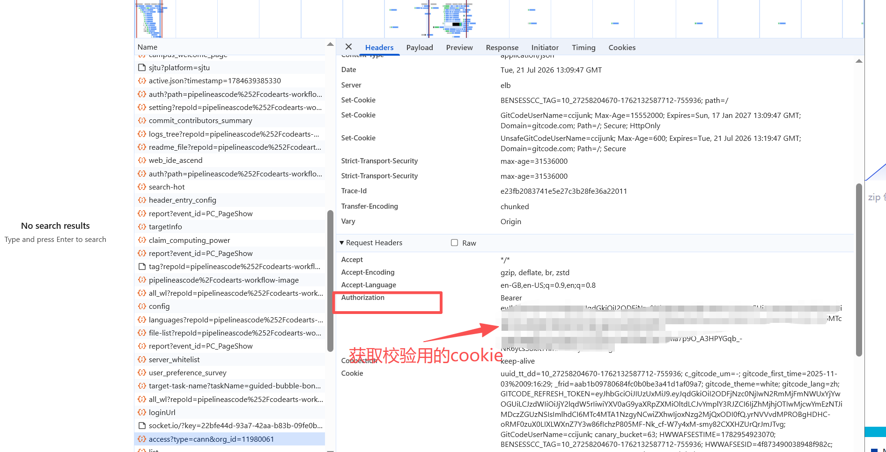

# YAML 校验指南

## 环境准备

### 需要配置的环境变量（写入项目根目录 `.env`）

```bash
# .env — 项目根目录
GITCODE_ACCESS_TOKEN=xxx          # v8 API token（run-case.sh 用）
GITCODE_EXECUTOR="ccijunk"        # GitCode 用户名（run-case.sh 用）
GITCODE_COOKIE=eyJ...             # v2 API cookie（extract-workflows.sh / validate_workflow.py 用）
GITCODE_OWNER="ComputingActionTest"
GITCODE_REPO="foundational-tests"
GITCODE_BRANCH="main"
```

### 获取 GITCODE_COOKIE



1. 浏览器打开 `https://gitcode.com` 并登录
2. F12 打开 DevTools → **Application** 标签 → 左侧 **Cookies** → 选 `https://gitcode.com`
3. 找到 `GITCODE_ACCESS_TOKEN`，复制其 **Value** 列的值
4. 粘贴到 `.env` 的 `GITCODE_COOKIE=` 后面

> 注意：`GITCODE_COOKIE` 的值就是浏览器 Cookie 中 `GITCODE_ACCESS_TOKEN` 的 Value，不是 v8 API 的 `GITCODE_ACCESS_TOKEN`。两者不同，不要混用。

### 初始化

```bash

# 2. 加载 .env
set -a && source <(grep -v '^#' .env | grep '=' | sed 's/ #.*//') && set +a
```

## 快速使用

```bash
# 1. 提取 workflow 并逐条校验
./phase02/scripts/extract-workflows.sh phase01/runs/<run-id>/cases/yaml/ tmp/

# 2. 单条校验
python phase02/scripts/validate_workflow.py tmp/<case>.yml
```

## 常见错误速查

| # | 错误 | 修复 |
|---|------|------|
| 1 | `on:` 数组格式 `on:\n- push` | 改为 map：`on:\n  push:` |
| 2 | 重复键 `name:` | 每个 job/step 只保留一个 `name:` |
| 3 | step name 含 `[` `]` | 替换为 `(` `)` |
| 4 | `${{ }}` 在未加引号的 `run:` 中 | 整个值加双引号，内部 `"` 转义 `\"` |
| 5 | `if:` 裸关键字 `always` | 改为 `${{ always() }}` |
| 6 | `runs-on` 多行列表 | 改为行内数组 `[ubuntu-latest, x64, small]` |
| 7 | `permissions` 含 `contents`/`pull-requests` | 删除整个 `permissions` 块 |
| 8 | `on.<event>.types` 非法值 | 见允许值表 |
| 9 | `on.<event>` branches 为空或超 32 | 至少 1 条，最多 32 条 |
| 10 | bare `- uses:` 缺 `name:` | 加 `name:` 行 |

## `on.<event>.types` 允许值

| 事件 | 允许 |
|------|------|
| `pull_request_comment` | `created`, `deleted`, `edited` |
| `merge_requests` | `close`, `merge`, `open`, `reopen`, `update` |

## 完整规则

详见 `phase01/schema/VALIDATION-RULES.md`
